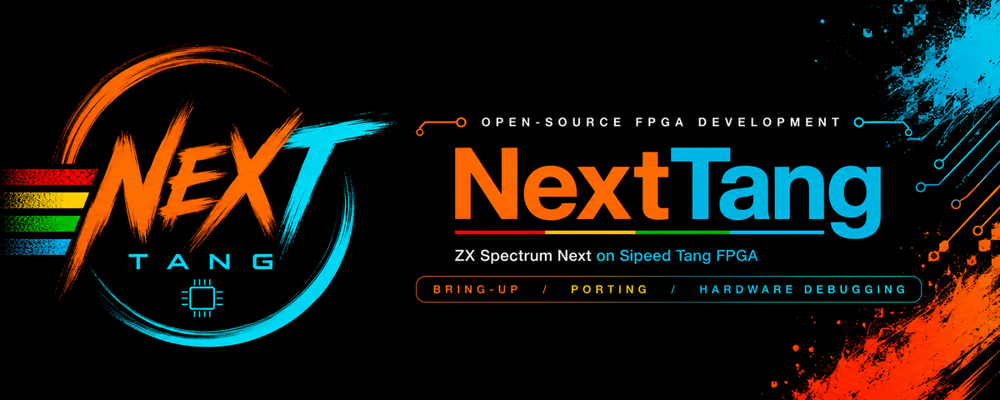

<p align="center">
  
</p>

<p align="center">
  <a href="LICENSE"></a>
  <a href="https://github.com/jattree/NextTang/actions/workflows/quality.yml"></a>
  <a href="#current-status"></a>
  <a href="#hardware-targets"></a>
  <a href="https://t.me/NextTang"></a>
  <a href="https://www.youtube.com/@NextTangFPGA"></a>
  <a href="https://github.com/jattree/NextTang/issues"></a>
</p>

<p align="center">
  <a href="ROADMAP.md">Roadmap</a> ·
  <a href="#hardware-targets">Hardware targets</a> ·
  <a href="docs/provenance.md">Provenance</a> ·
  <a href="docs/toolchain.md">Toolchain</a> ·
  <a href="https://t.me/NextTang">Telegram</a> ·
  <a href="https://www.youtube.com/@NextTangFPGA">YouTube</a> ·
  <a href="#contributing">Contributing</a> ·
  <a href="#references">References</a>
</p>

## Current status

> [!IMPORTANT]
> The Console 138K now boots a user-supplied Sinclair 48K ROM through the
> imported T80 and standard upstream ULA, with the ULA-visible lower 16 KiB in
> on-chip block RAM and the CPU's upper 32 KiB served from onboard DDR3. This
> is a hardware-verified platform slice, not yet the ZX Spectrum Next machine
> core or a broad compatibility claim.

The `ula` profile reads the Spectrum display file from on-chip machine RAM,
captures complete native 360 x 288/50 Hz ULA frames and presents a 2x
720 x 576 image inside the established 1280 x 720/60 HDMI output. A triple
frame buffer keeps the machine and HDMI clock domains separate and changes the
displayed bank only at a complete output-frame boundary. Five consecutive
volatile-SRAM loads produced clean settled Elgato frames and matching FT232RL
status with no framebuffer overrun or capture-protocol error. The exact
C-device build reports zero setup and hold violations. Generated bitstreams,
the user ROM and hardware captures remain outside Git.

The separate `ula-ddr-upper` profile retains that video path while moving CPU
addresses `0x8000` to `0xffff` behind the bounded clock-domain and DDR3
service. A fail-first WAIT regression caught the CPU advancing before an upper
memory request had completed. Hardware then exposed a second regression: the
Gowin controller must accept each write command and its data together and be
given a bounded drain before the following read. With both causal fixes in
place, the exact-C image boots the ROM and repeatedly prints the same complete
`nexttang was here` loop as the internal-RAM control. The status UART reports
opcode activity, an upper-RAM write and live calibration, with timeout,
overrun and calibration-loss clear. This verifies one 48K split-memory
workload on the received 30354 SOM; it does not verify banked Next memory,
contention or general game compatibility.

The original colour-bar/logo smoke image and the simpler 48K renderer remain
separate rollback targets. Source, constraints and regressions are under
[`boards/console138k/`](boards/console138k/), [`rtl/video/`](rtl/video/) and
[`tests/`](tests/).

Bring-up status is deliberately split between NextTang-owned behaviour and the
factory TangCore baseline:

| Area | Current evidence |
| --- | --- |
| JTAG and programming | Hardware-verified 6 MHz scan and volatile SRAM loading; Gowin `GW5AST-138`, IDCODE `0x1081b` |
| Clocks | The 50 MHz board input, 74.375 MHz pixel path and 28/14/7/3.5 MHz machine tree are connected in the hardware-running 48K ULA image. 14 and 7 MHz divide from 28 through `CLKDIV` under one reset and 3.5 divides from 7, after three separate PLL outputs declared as independent clocks hid a hold violation inside the upstream ULA and made the design placement-dependent. The 3.5 MHz cadence is independently bounded by the decoded UART interval; the other machine clocks are vendor-model and build-verified but have not each been measured at a pin |
| UART | Hardware-decoded through an external FT232RL. The current image reports video lock, CPU opcodes, screen writes, complete scaled frames, overrun and capture-protocol status on each line |
| HDMI | Hardware-verified for 720p60 output, the standard 48K/50 Hz upstream ULA raster and frame-safe 50-to-60 Hz conversion; no HDMI audio |
| DDR3 | Hardware-verified on the 30354 1 GB Hynix SOM: calibration, paired writes, read-back, every usable address-line position, the 512 MB boundary and the final aligned 32-byte beat pass with distinct retained patterns. The first integrated machine workload also boots the 48K ROM with CPU addresses `0x8000`-`0xffff` served from DDR3 while the ULA-visible lower 16 KiB remains local. The Console input is 50 MHz and the working path retains Gowin's generated dynamic PLL and `PLL_INIT`. Exhaustive every-cell, sustained-load and banked-Next testing remain open ([resolved issue #5](https://github.com/jattree/NextTang/issues/5)) |
| Tape | Hardware-verified. A user-supplied TZX is played into the EAR input for the ROM's own loader. Manic Miner loads and runs; Cobra loads through its own turbo speed loader to its credits. The tape and every generated memory image stay outside Git |
| SD | Factory TangCore reads the supplied card and loads packaged cores; no NextTang SD implementation |
| Audio | Not brought up |
| USB HID | The supplied controller navigates factory TangCore. NextTang reads a USB keyboard through that same firmware's PS/2 scan code message on its 2 Mbit/s UART, so the MCU is not reflashed and hubs and multiple devices stay its concern. Decoded to the forty key matrix the Next uses. Build-verified and simulated; not yet hardware-verified |

The first DDR-to-video integration is also hardware-verified. An exact-C demo
stores the 16 KiB RGB332 logo in onboard DDR3, repeatedly refills alternating
on-chip display buffers from DDR3, and advances the logo only after a complete
refill. This proves a bounded live DDR consumer, not the machine CPU/video
memory service or a full-screen DDR framebuffer.

The next engineering gate is replacing this deliberately narrow 48K split with
the wider core's banked memory contract while retaining the verified ULA and
DDR3 paths. Storage and audio follow, and physical input needs verifying on
hardware, before any ZX Spectrum Next compatibility claim. The
[starter roadmap](ROADMAP.md) defines the required evidence.

The one part of the project not waiting on that board is the
[host tooling track](ROADMAP.md#host-tooling-track), which builds the DZRP client and
command-subset conformance suite against existing remotes.

## What NextTang is

NextTang is an independent, community-developed port of the
[ZX Spectrum Next](https://www.specnext.com/) FPGA implementation to
[Sipeed Tang Console](https://wiki.sipeed.com/hardware/en/tang/tang-console/mega-console.html)
boards. The initial hardware target is the Tang Console 138K, with a shared
platform design intended to support the Tang Console 60K as well.

The project starts from the actively maintained
[MiSTer ZXNext core](https://github.com/MiSTer-devel/ZXNext_MISTer), which is a
port of the [official ZX Spectrum Next FPGA sources](https://gitlab.com/SpectrumNext/ZX_Spectrum_Next_FPGA).
It will replace the MiSTer-specific platform layer with a Gowin/Tang platform
shell rather than reimplementing the Next specification from scratch.

The project grew from the community discussion about the unavailable
[NextNano v0.1 corresponding source](https://github.com/RetroSilicon/NextNano/issues/1).
NextTang does not depend on that source becoming available, but future
cooperation or code sharing is welcome where technically and legally possible.

## Goals

- Boot and run ZX Spectrum Next software on supported Tang Console boards.
- Keep the ZXNext logic close to its upstream source and isolate board-specific
  clocks, memory, video, audio, storage, and input behind narrow interfaces.
- Support both 60K and 138K targets from one source tree rather than through
  divergent forks.
- Add developer-oriented hardware debugging: halt, step, registers, MMU state,
  page-aware breakpoints, watchpoints, and triggered instruction tracing.
- Publish source, build instructions, exact tool versions, test artifacts, and
  known compatibility limits.

## Non-goals

- Claiming endorsement by or equivalence to official ZX Spectrum Next hardware.
- Treating emulator or alternate-FPGA results as official-hardware proof.
- Redistributing NextZXOS, ROMs, games, or other third-party copyrighted files.
- Making the first bitstream wait for the complete debugger.

## Hardware targets

| Target | Intended role | Status |
| --- | --- | --- |
| Tang Console 138K | Initial port, full development instrumentation, deep trace | `GW5AST-LV138PG484AC1/I0` identified; JTAG, DDR3, 48K CPU/ROM/BASIC, standard upstream ULA and frame-safe 720p output hardware-verified for the inspected 30354 1 GB SOM configuration |
| Tang Console 60K | Portable release core and lighter debugging | Planned; contributor wanted |
| Tang Nano 20K | Later compact release target; not a development platform | In scope; not currently scheduled |

Both Console targets will use the same core and debugger protocol. Features
that depend on available FPGA resources will be discovered at runtime through a
capability bitmap instead of creating incompatible tools.

## Planned build profiles

| Profile | Purpose | Expected targets |
| --- | --- | --- |
| `release` | Smallest compatible core without development instrumentation | 60K and 138K |
| `debug-lite` | Halt, step, state inspection, and a small breakpoint set | 60K and 138K if synthesis permits |
| `debug-full` | Extended watchpoints and deep triggered trace | 138K initially |

Resource availability is not assumed. Each profile must pass synthesis and
timing analysis on its exact FPGA device and board revision.

## Planned architecture

```text
rtl/                 Shared ZXNext RTL
platform/common/     Shared platform and capability interfaces
boards/nano20k/      20K compact release top level and constraints
boards/console60k/   60K top level, constraints, PLL, and memory IP
boards/console138k/  138K top level, constraints, PLL, and memory IP
debug/               Debug control, breakpoints, watchpoints, and trace
host/                Host-side protocol tools and debugger integration
sim/                 Portable simulations and fixtures
tests/               Build, compatibility, and hardware smoke tests
docs/                Architecture, provenance, and verification records
```

The [starter roadmap](ROADMAP.md) turns this structure into milestones with
explicit completion evidence.

## Developer setup

The repository has deterministic quality checks and fail-closed synthesis entry
points. The Console 138K has a vendor `release` driver for the verified smoke
image. This driver does not build the planned machine core.

`make check` drives three external tools directly and fails without them, on
either toolchain: `iverilog` for the Verilog testbenches, `ghdl` for the VHDL
testbenches and `sjasmplus` for the diagnostic boot ROM. `make doctor` names any
that are missing. On Debian or Ubuntu:

```bash
sudo apt-get install iverilog ghdl
```

`sjasmplus` is not packaged; build it from the tag pinned in
[`toolchain/versions.env`](toolchain/versions.env), as
[`.github/workflows/quality.yml`](.github/workflows/quality.yml) does.

```bash
cp .env.example .env.local
make doctor
make check
make show-config
make TOOLCHAIN=vendor TARGET=console138k PROFILE=release synth
```

The hardware-verified destructive DDR3 diagnostic has a separate build entry
because its generated Gowin controller and PLL sources cannot be redistributed
by this repository. Generate or obtain the matching files locally, keep them
outside Git, then provide their containing directory explicitly:

```bash
mkdir -p /tmp/nexttang-ddr3-build
boards/console138k/build_ddr3.sh \
  --toolchain vendor \
  --profile diagnostic \
  --vendor-source /absolute/path/to/ddr_memory_test_uart/src \
  --output /tmp/nexttang-ddr3-build
```

The driver requires an empty output directory, checks fresh reports and timing,
and records repository and vendor-source hashes beside the generated bitstream.

The first hardware-verified machine/DDR integration uses the same private
vendor-source boundary. It keeps the lower 16 KiB local for the ULA and serves
the upper 32 KiB from DDR3:

```bash
mkdir -p /tmp/nexttang-spectrum48-ddr
NEXTTANG_48K_ROM=/absolute/path/to/48.rom \
boards/console138k/build_spectrum48.sh \
  --toolchain vendor \
  --profile ula-ddr-upper \
  --vendor-source /absolute/path/to/generated/ddr3/source \
  --output /tmp/nexttang-spectrum48-ddr
```

The ROM and generated Gowin DDR3/PLL sources are user-supplied build inputs and
are not redistributed by this repository.

See the [toolchain guide](docs/toolchain.md) for the provisional Gowin and
open-source tool versions and supported target/profile combinations. Other
target, profile and toolchain combinations remain unimplemented and fail closed.
Board integrations must implement the documented
[build-driver contract](boards/README.md).

Public technical decisions and verification evidence belong in the relevant
documentation, GitHub issue, or pull request so contributors can inspect and
reproduce them.

## Contributing

The project is at the stage where early hardware and toolchain experience has
high leverage. Useful contribution areas include:

- Tang Console 60K or 138K board ownership and repeatable hardware testing;
- Gowin EDA, [Yosys](https://github.com/YosysHQ/yosys),
  [nextpnr](https://github.com/YosysHQ/nextpnr), or
  [Project Apicula](https://github.com/YosysHQ/apicula) experience;
- mixed VHDL/SystemVerilog integration;
- DDR3, HDMI, SD, USB HID, and onboard USB controller firmware;
- Z80N/Next compatibility testing; and
- FPGA trace and source-debugger design.

Read [CONTRIBUTING.md](CONTRIBUTING.md), then start with a
[GitHub issue](https://github.com/jattree/NextTang/issues) stating
which board and exact silicon revision you have, which operating system and
toolchain you can use, and the area you would like to work on. Small,
independently verifiable contributions are preferred.

Project discussion, coordination, announcements, and roadmap updates are hosted
in the [NextTang Telegram group](https://t.me/NextTang). Less technical project
updates and build videos are on the [NextTang YouTube channel](https://www.youtube.com/@NextTangFPGA).

## References

- [Official ZX Spectrum Next FPGA repository](https://gitlab.com/SpectrumNext/ZX_Spectrum_Next_FPGA)
- [MiSTer ZXNext core](https://github.com/MiSTer-devel/ZXNext_MISTer)
- [Pinned upstream and per-file provenance audit](docs/provenance.md)
- [Adjacent Tang project evidence and reuse boundaries](docs/adjacent-projects.md)
- [YouTube channel CLI for project host tooling](docs/youtube-cli.md)
- [Sipeed Tang Console documentation](https://wiki.sipeed.com/hardware/en/tang/tang-console/mega-console.html)
- [Sipeed Tang Mega 138K examples](https://github.com/sipeed/TangMega-138K-example)
- [ZXSpectrumNextTests](https://github.com/MrKWatkins/ZXSpectrumNextTests)
- [DeZog Remote Protocol](https://github.com/maziac/DeZog/blob/main/design/DeZogProtocol.md)
- [JNext emulator and debugger](https://github.com/jorgegv/jnext)
- [dezogif](https://github.com/maziac/dezogif) and
  [dezogif_ng](https://github.com/jorgegv/dezogif_ng), DZRP debug stubs for real Next hardware
- [NextNano source discussion](https://github.com/RetroSilicon/NextNano/issues/1)

## Independence and license

NextTang is not affiliated with or endorsed by SpecNext Ltd, Sipeed, MiSTer,
or RetroSilicon. Product and project names belong to their respective owners.

Original work in this repository is released under the
[GNU General Public License v3.0](LICENSE). Imported source will retain its
copyright, attribution, modification notices, and license terms. The
[upstream audit and import policy](docs/provenance.md) records the selected
baseline before any upstream HDL is committed. Synthesized releases containing
the audited BSD-style components must include
[the third-party notices](THIRD_PARTY_NOTICES.md).
